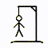

# Kindle Games

A collection of classic games optimized for the Amazon Kindle's experimental browser and E-Ink displays.

## 🎮 Games Included

| | | |
|:---:|:---:|:---:|
|    **Tic-Tac-Toe** |    **Memory Game** |    **Sudoku** |
|    **Battleship** |    **Word Search** |    **Hangman** |
|    **Connect 4** | | |

## 🚀 Features

- **E-Ink Optimized**: High contrast, minimal animations, and ghosting mitigation.
- **ES5 Compatible**: Works on old Kindle browsers without modern JS support.
- **Offline Support**: Uses HTML5 Application Cache for play without Wi-Fi.
- **Multilingual**: Supports Portuguese, English, and Spanish.
- **AI Opponents**: Play against the computer in Tic-Tac-Toe, Battleship, and Connect 4.

## 📥 Installation

1. Clone this repository.
2. Deploy to a static file server (e.g., Nginx, GitHub Pages).
3. Access the `index.html` from your Kindle's web browser.

## 🛠 Tech Stack

- **HTML5 / CSS3** (Legacy Webkit support)
- **Vanilla JavaScript** (ES5 strictly)
- **App Cache** (Offline manifest)

## 📜 Guidelines

For technical constraints and implementation details, see [GUIDELINES.md](GUIDELINES.md).
